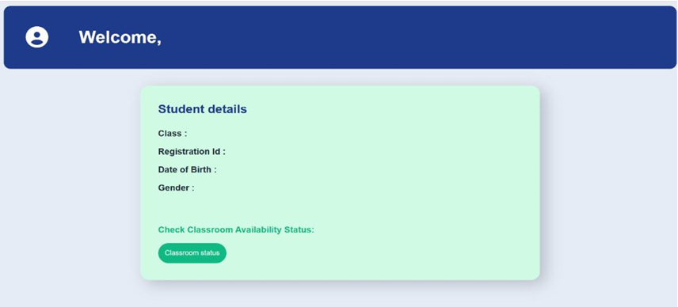
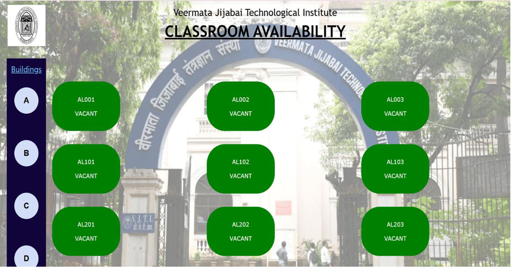
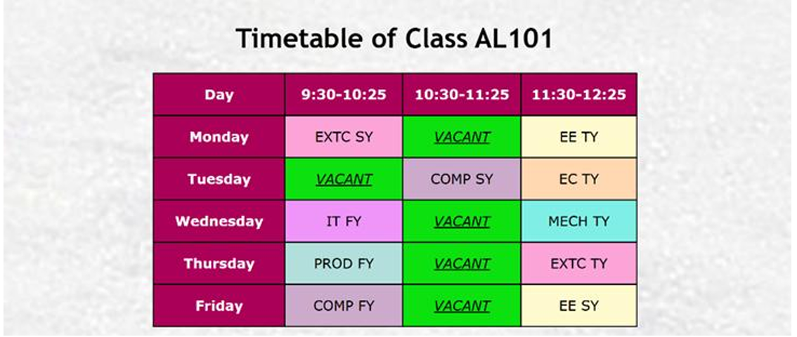

# Class Booking System

A web-based application that allows students and teachers to book and manage classes through responsive login and personalized dashboards.

## Features

- Role-based login for students and teachers  
- Students can view  available classes  
- Teachers can create and manage class schedules  
- Personalized dashboards for each user  
- Responsive user interface styled with CSS  

## Tech Stack

- HTML  
- CSS  
- JavaScript  
- Firebase (for authentication and database)

## Project Preview

  
  
  
  
  

## Contributors

- Tanisha Nevrekar ([GitHub](https://github.com/Nutella006))  
- Muskaan Karwa ([GitHub](https://github.com/muskaankarwa))  
- Swamini Jadhav ([GitHub](https://github.com/swamini-jadhav))  
- Sarvaarth Naraang ([GitHub](https://github.com/SarvaarthN))  
- Ananya Rane ([GitHub](https://github.com/AnanyaRane27))

